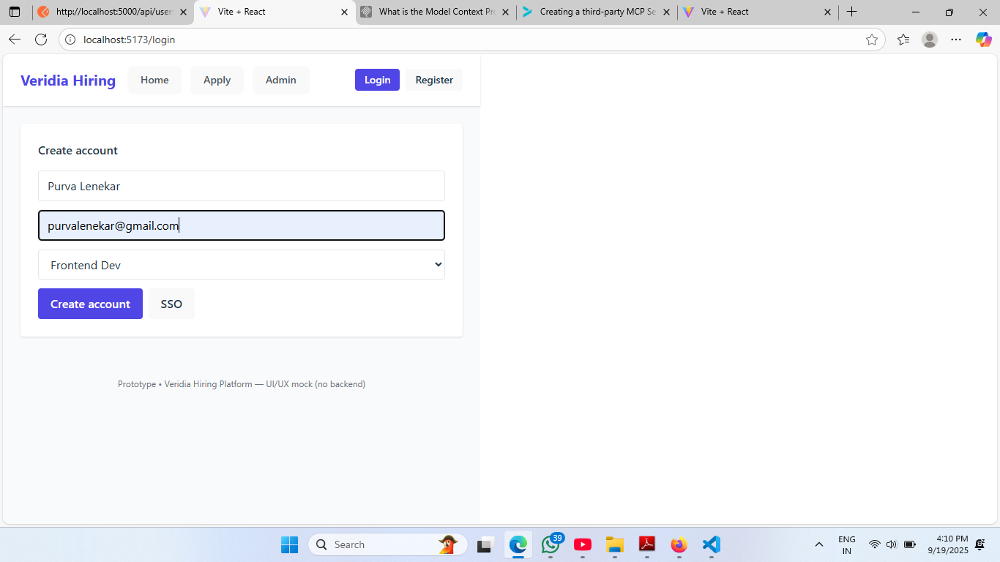
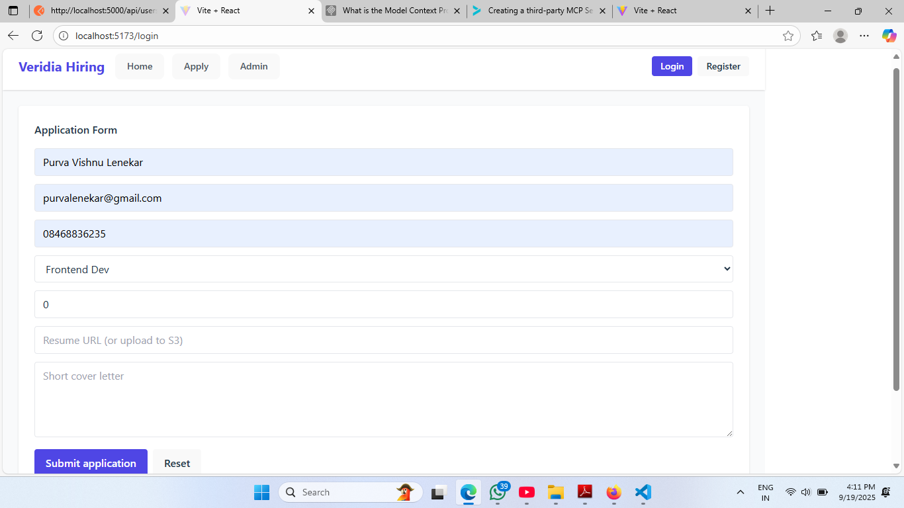
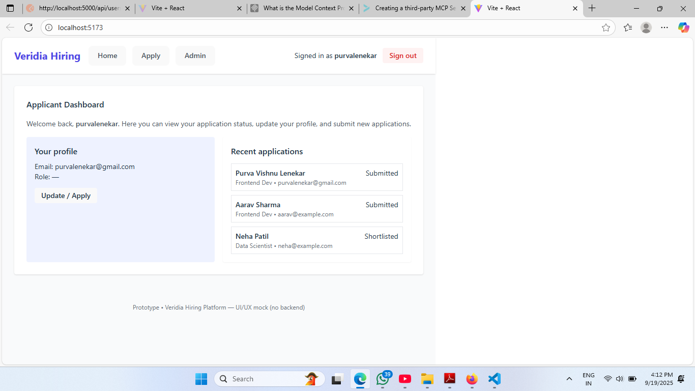

🌐 Veridia Hiring Platform – Frontend Prototype

This repository contains a frontend prototype of the Veridia Hiring Platform, built using React + Vite + Tailwind CSS.
The prototype demonstrates clean and responsive UI designs for Login, Register, and Dashboard pages.

✨ Features

📱 Responsive UI – Works across devices.

🎨 Modern Design – Styled with Tailwind CSS.

🔑 Authentication Screens – Login & Register pages included.

📊 Dashboard Prototype – Basic layout for user interactions.

⚡ Fast Development – Powered by Vite for quick builds and hot reloading.

🛠️ Tech Stack

React – Component-based UI

Vite – Lightning-fast bundler

Tailwind CSS – Utility-first styling

🚀 Getting Started

Follow these steps to set up and run the project locally:

1️⃣ Clone the repository
    git clone https://github.com/PurvaLenekar/veridia-hiring-platform.git
    cd veridia-hiring-platform/frontend

2️⃣ Install dependencies
    npm install

3️⃣ Start the development server
    npm run dev

📂 Folder Structure

frontend/
│── src/
│   ├── pages/          # Contains Login, Register, Dashboard components
│   ├── App.jsx         # Main app with routing setup
│   ├── main.jsx        # Entry point
│   └── index.css       # Global styles
│── package.json
│── README.md

## 📸 Screenshots  

**Login Page**  
  

**Register Page**  
  

**Dashboard**  
 
                       (./screenshots/dashboard2.png) 

🔮 Future Improvements

Backend integration with Node.js + MongoDB

JWT-based Authentication & Authorization

Role-based dashboards (Admin / Candidate / Recruiter)

Advanced analytics & charts